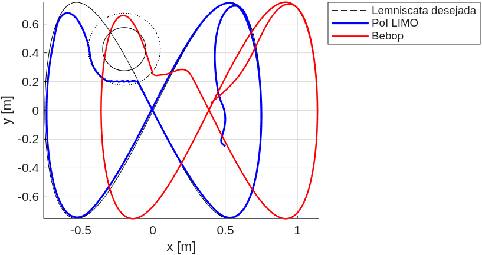
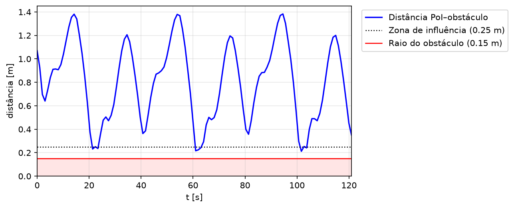
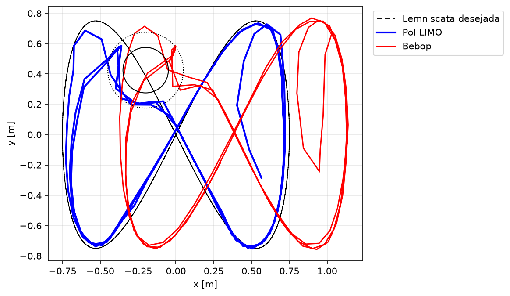
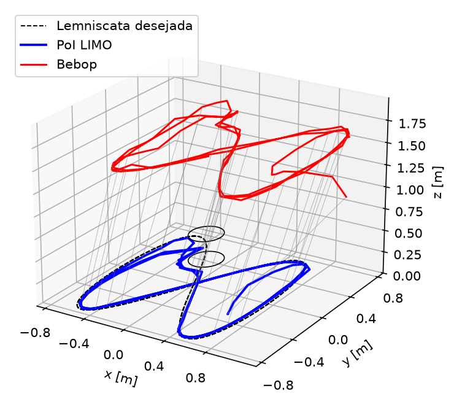
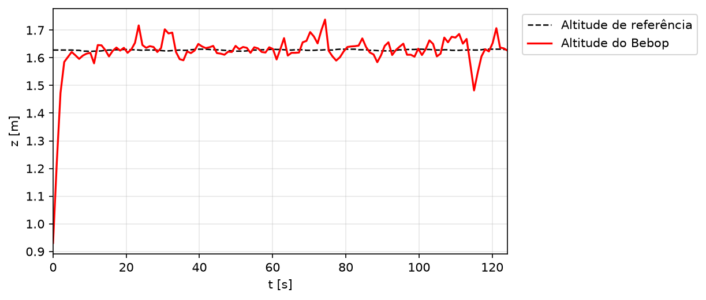
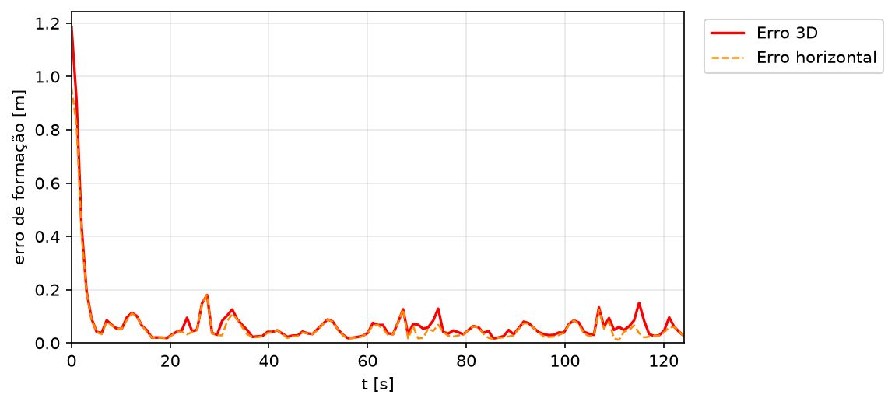

# LIMO Bebop Virtual — Controle de Formação por Estrutura Virtual

Trabalho prático da disciplina **Robótica Móvel — UFES (2026/1)**. Controlador MATLAB/ROS de
formação por estrutura virtual entre um robô terrestre diferencial (AgileX LIMO) e um
quadrimotor (Parrot Bebop 2), com desvio de obstáculo por espaço nulo.

- João Gabriel Santos Custodio — joao.custodio@edu.ufes.br
- Filipe Nunes da Silva Mai — filipe.mai@edu.ufes.br

## Script

Todo o controlador está em [`limo_bebop.m`](limo_bebop.m). Ele:

1. controla o ponto de interesse (PoI) do LIMO, deslocado `a = 0,10 m` à frente do centro do
   robô, por um laço cinemático saturado (`tanh`) + compensador dinâmico com os parâmetros
   identificados `θ₁…θ₆`;
2. mantém o Bebop num offset fixo `[ρ_f, α_f, β_f]` em relação ao PoI (`ρ_f = 1,5 m`,
   `α_f = 0°`, `β_f = 75°`), com laço externo `tanh`, controle cinemático de guinada e
   compensador dinâmico próprio (`f₁`, `f₂`);
3. dá prioridade máxima ao desvio de obstáculo, por projeção em espaço nulo de um campo
   potencial repulsivo gaussiano;
4. tem decolagem e pouso comandados pelo joystick (Botão A / Botão B), com sobrescrita manual
   contínua pelos eixos analógicos e uma janela de ~8 s de afastamento manual do drone antes do
   pouso automático — para não deixar o Bebop descer em cima do LIMO quando a formação termina
   com os dois próximos.

### Geometria e referência

Com `TRAJ = 1`, a referência do LIMO é uma lemniscata:

$$
x_d = 0.75\sin\left(\frac{2\pi t}{40}\right), \qquad
y_d = 0.75\sin\left(\frac{4\pi t}{40}\right)
$$

O enunciado original pede o drone diretamente acima do LIMO (`β_f = 90°`), configuração singular
em que o azimute deixa de ter efeito observável. Um primeiro ensaio com `β_f = 60°` levou o drone
para fora da parede virtual em menos de um minuto; `β_f = 75°` foi o valor efetivamente validado
em voo, resultando no deslocamento constante `Δ = [0,388; 0,000; 1,449] m` entre o PoI e o alvo
do Bebop. O obstáculo é um cilindro (balde) centrado em `[-0.20; 0.425] m`, com raio físico de
`0.15 m` e zona de influência de `0.25 m`. O controlador roda a `1/30 s` por ciclo.

### Segurança

- botão de decolagem (A) e botão de parada de emergência (B) no joystick;
- sobrescrita manual do comando do Bebop pelo analógico, ativa a qualquer momento, sem precisar
  de botão dedicado;
- janela de afastamento manual antes do pouso automático;
- parede virtual por direção (`x ∈ [-1,5; 1,5] m`, `y ∈ [-1,1; 1,1] m`, `z ≤ 1,8 m`);
- *watchdog* de perda de corpo rígido no OptiTrack (`> 0,5 s`);
- bloco `try/catch` que aciona o pouso em caso de erro em tempo de execução.

## Resultados

Ensaios feitos na arena do LAB-AIR, com poses do LIMO e do Bebop via OptiTrack/ROS e comandos de
velocidade enviados pelo mesmo barramento, a 30 Hz.

### 1. Simulação

Antes do voo real, o mesmo controlador foi rodado com uma planta virtual do Bebop, integrando o
modelo dinâmico identificado a partir dos comandos calculados, sem depender de OptiTrack nem de
hardware.

*Caminho do ponto de controle do LIMO contra a lemniscata de referência, com o obstáculo e sua
zona de influência.*

*LIMO e planta virtual do Bebop, mostrando a separação horizontal constante que `β_f = 75°`
produz entre as duas curvas.*

### 2. LIMO isolado (Bebop desligado)

Com o Bebop desligado, apenas o LIMO foi comandado ao longo da lemniscata, com o desvio de
obstáculo ativo.

*Caminho do LIMO comparado à lemniscata de referência.*

*Distância do ponto de controle ao centro do obstáculo ao longo do ensaio.*

| Métrica | Valor |
| --- | --- |
| Erro de rastreio, longe do obstáculo (> 0,35 m) | RMS 0,053 m, máx 0,105 m |
| Erro de rastreio, região do obstáculo | RMS 0,231 m, máx 0,346 m |
| Erro de rastreio, global (após 5 s de transitório) | RMS 0,086 m, máx 0,346 m |
| Distância mínima ao centro do obstáculo | 0,209 m |
| Folga em relação ao raio físico (0,15 m) | 0,059 m |
| Passagens pela zona de influência | 3 (t ≈ 21, 61 e 102 s) |

### 3. Formação completa em voo

Ensaio final com o Bebop voando, 124 s (5 s de preparação + 119 s de trajetória ativa),
registrado em `results/limo_bebop_final/audit_20260722_183650.txt`. As métricas abaixo excluem a
fase de preparação.

*Trajetória desejada, caminho do PoI do LIMO, caminho do Bebop e obstáculo, no plano XY.*

*Vista tridimensional do ensaio, com segmentos ligando o PoI ao drone em instantes amostrados.*

*Altitude do Bebop ao longo do ensaio, comparada à referência de 1,449 m acima do PoI.*

*Erro de formação do Bebop em relação ao alvo, total (3D) e projetado no plano horizontal.*

| Métrica | Valor |
| --- | --- |
| Erro de formação 3D | RMS 0,064 m, máx 0,180 m |
| Erro de formação horizontal | RMS 0,055 m, máx 0,180 m |
| Altitude do drone | 1,633 ± 0,033 m |
| Erro de altitude | RMS 0,033 m, máx 0,146 m |
| Amostras em saturação do Bebop | 288 de 3686 (7,8%) |
| Erro de rastreio do LIMO, longe do obstáculo | RMS 0,057 m, máx 0,135 m |
| Erro de rastreio do LIMO, região do obstáculo | RMS 0,252 m, máx 0,357 m |
| Distância mínima ao centro do obstáculo | 0,207 m |

O erro de formação parte de 1,19 m (drone convergindo para a posição inicial) e converge para a
faixa de 0,05–0,18 m em cerca de 5 s. Os extremos da posição do drone durante o ensaio, contra a
parede virtual configurada: `x` entre −0,371 e +1,138 m (limite ±1,5 m, folga 0,362 m); `y` entre
−0,757 e +0,769 m (limite ±1,1 m, folga 0,331 m); `z` entre +1,482 e +1,738 m (limite 1,8 m,
folga de apenas 0,062 m — a referência de altitude soma a altura *medida* do LIMO em vez de
assumi-la como zero, o que reduz essa folga).

## Vídeo e log

- Vídeo do ensaio: [Google Drive](https://drive.google.com/file/d/1J7OOrRWm8rbpuwKaXejXVPVas6zfAfQI/view?usp=drive_link)
- Log completo do ensaio: [`logs_simulation.txt`](logs_simulation.txt)
